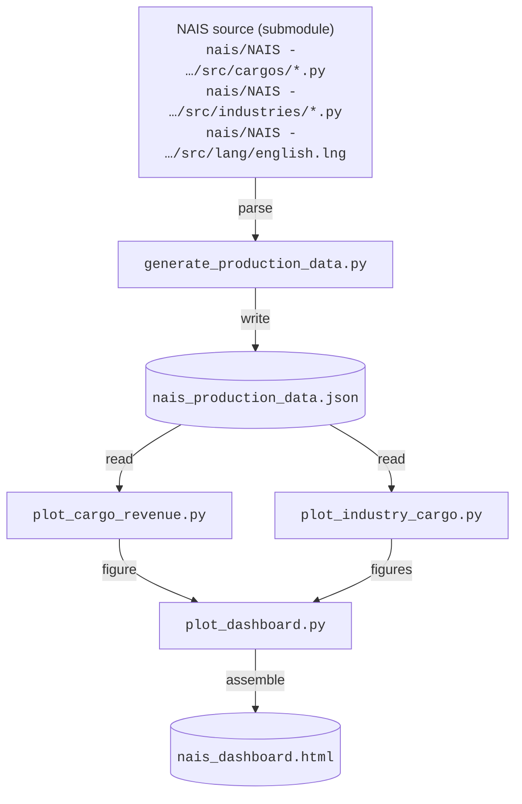

# NAIS Analysis Dashboard

**[Live Dashboard →](https://allenator.github.io/nais-analysis/)**

Interactive analysis and visualization of the [NAIS (North American Industry Set)](https://www.tt-forums.net/viewtopic.php?t=84039) for [OpenTTD](https://www.openttd.org/). Extracts industry and cargo definitions directly from the NAIS source code, generates a structured JSON dataset, and produces a unified Plotly dashboard.

## Dashboard Views

| Tab | Description |
|-----|-------------|
| 💰 **Cargo Revenue** | Revenue vs distance curves for all 30 cargo types, with a speed slider (10–300 km/h) and per-trip / per-day toggle. Implements the full OpenTTD four-regime payment formula. |
| 🔀 **Cargo Flow (Sankey)** | Full cargo flow network: Primary → Cargo → Secondary/Tertiary. Nodes show detailed hover info (production rules, combo boost, payment properties). Filterable by cargo and industry. |
| 📊 **Primary Production** | Box plots of base and Level 2 supply-boosted production ranges for every primary industry, grouped by cargo type. |
| 🔥 **Secondary Heatmap** | Conversion output heatmap — output per 8 units of input (all inputs present, normalized by number of inputs) for every secondary industry. |
| ⚡ **Combo Boost** | Side-by-side comparison of solo vs combined delivery output, highlighting the combinatory boost percentage for each secondary industry. |

## Project Structure

```
├── nais/
│   └── NAIS - NORTH AMERICAN INDUSTRY SET/   # NAIS source (git submodule)
│       └── src/
│           ├── cargos/          # Cargo definitions (payment, classes, weight, …)
│           ├── industries/      # Industry definitions (ratios, boost flags, …)
│           └── lang/            # String tables (english.lng)
├── scripts/
│   ├── generate_production_data.py   # Source parser → JSON
│   ├── plot_cargo_revenue.py         # Revenue figure builder
│   ├── plot_industry_cargo.py        # Sankey, primary, heatmap, combo builders
│   ├── plot_dashboard.py             # Assembles all figures into tabbed HTML
├── data/                              # Generated (gitignored)
│   └── nais_production_data.json
└── dashboard/                         # Generated (gitignored)
    └── nais_dashboard.html
```

## Data Pipeline



All data flows from the NAIS source through the generation script into JSON. The plot scripts read only from JSON — no hardcoded industry or cargo data.

## Scripts

### `generate_production_data.py`

Parses the NAIS source directory to extract:

- **Cargo definitions** — name, price factor, penalty lower bound, single penalty length, cargo classes, freight flag, weight, town growth effect, capacity multiplier
- **Primary industries** — type, accepted cargos, production multipliers, production ranges (min/max/weighted average), supply boost thresholds
- **Secondary industries** — input/output ratios, combinatory boost flag, full production tables for every combination of delivered inputs
- **Tertiary industries** — accepted cargos, any production outputs

Validates the generated output against any existing JSON and reports differences before overwriting.

```bash
python scripts/generate_production_data.py              # generate + validate
python scripts/generate_production_data.py --skip-validate   # generate only
```

### `plot_cargo_revenue.py`

Builds the cargo revenue figure. Implements the OpenTTD cargo payment formula:

```
revenue = price_factor / 200 × amount × distance × time_factor / 255
```

The time factor uses the four-regime model (post [PR #10596](https://github.com/OpenTTD/OpenTTD/pull/10596)):

1. **Flat** (`t ≤ d1`): `tf = 255` — maximum payment, no decay
2. **Slope −1** (`d1 < t ≤ d1+d2`): `tf = 255 − (t − d1)`
3. **Slope −2** (`d1+d2 < t ≤ tmax`): `tf = 255 − 2(t−d1) + d2`, floored at 31
4. **Asymptotic** (`t > tmax`): `tf = 31·FRAC / (x/(2·FRAC) + 1)` — approaches 1, never zero

Where `d1` = `penalty_lowerbound` and `d2` = `single_penalty_length`, both in **aging periods** (1 period = 2.5 game days).

### `plot_industry_cargo.py`

Exports four figure builders:

| Function | Figure |
|----------|--------|
| `build_sankey_figure()` | Cargo flow Sankey with rich hover, best-producer stars, and filtering metadata |
| `build_primary_figure()` | Primary production range box plots with supply boost levels |
| `build_heatmap_figure()` | Secondary conversion output heatmap (normalized by input count) |
| `build_combo_figure()` | Solo vs combined delivery grouped bar chart with boost annotations |

Secondary output normalization: `total_output_across_inputs / n_inputs` — makes values comparable across industries with different numbers of inputs.

### `plot_dashboard.py`

Assembles all figures into a single tabbed HTML page with:

- Consistent theme across all plots
- Sticky tab bar with keyboard-accessible navigation
- Sankey filter dropdown (cargo and industry checkboxes with search)
- Revenue chart speed slider that persists across trip/day toggle
- NAIS version display from JSON metadata
- Git commit info for NAIS submodule and dashboard repo in footer

```bash
python scripts/plot_dashboard.py    # writes dashboard/nais_dashboard.html
```

## Requirements

- Python 3.10+
- [uv](https://docs.astral.sh/uv/) (recommended) or pip
- [Plotly](https://plotly.com/python/) with Express extra (`pip install "plotly[express]"`)

No other dependencies. The NAIS source (git submodule) is required to generate the JSON dataset.

## Quick Start

```bash
# Set up environment
uv venv nais-venv
uv pip install "plotly[express]"

# Initialize NAIS submodule (if not already cloned with --recurse-submodules)
git submodule update --init --recursive

# Generate data from NAIS source
nais-venv/bin/python scripts/generate_production_data.py

# Build the dashboard
nais-venv/bin/python scripts/plot_dashboard.py

# Open in browser
open dashboard/nais_dashboard.html
```

## Deployment

The dashboard is automatically built and deployed to GitHub Pages on every push to `main` via the [deploy-pages](.github/workflows/deploy-pages.yml) workflow. The CI pipeline checks out the NAIS submodule, generates the JSON from source, builds the dashboard, and deploys it — no build artifacts are committed to the repository.

## License

Licensed under [GPL v2](LICENSE), consistent with the [NAIS](https://www.tt-forums.net/viewtopic.php?t=84039) / [FIRS](https://github.com/andythenorth/firs) upstream license.
